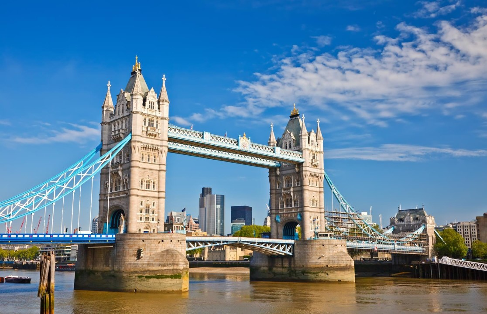
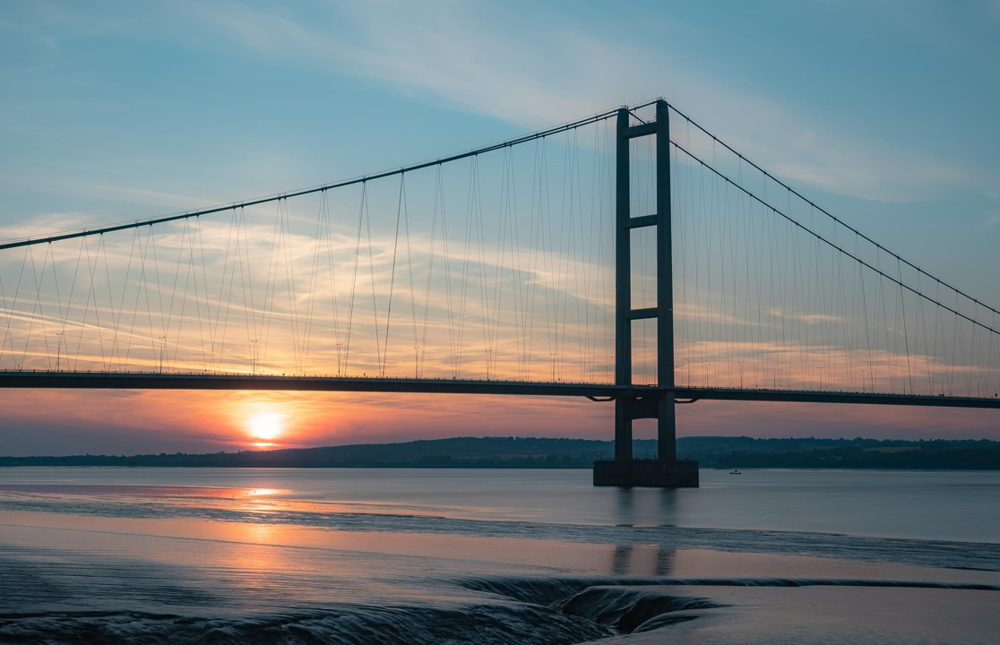
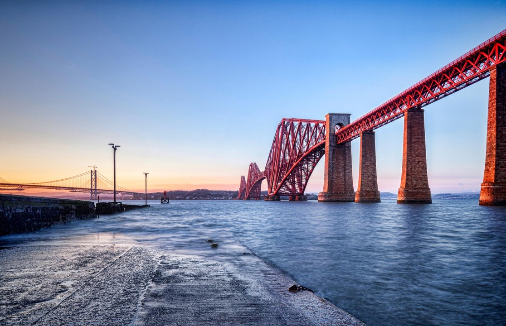
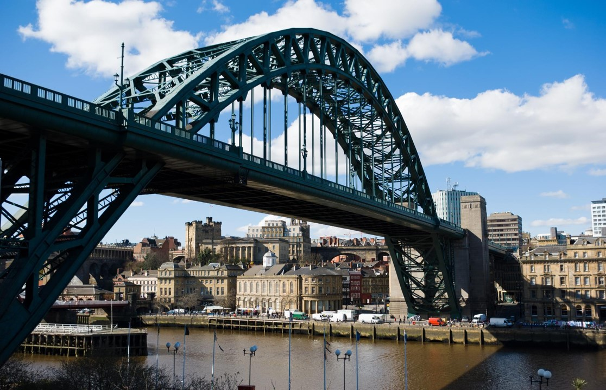
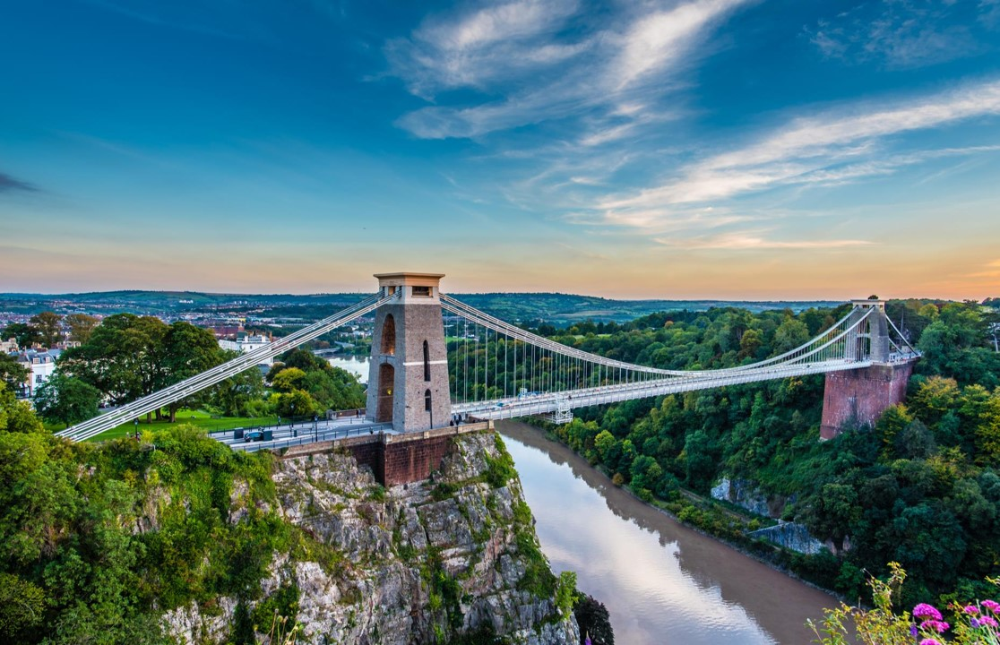
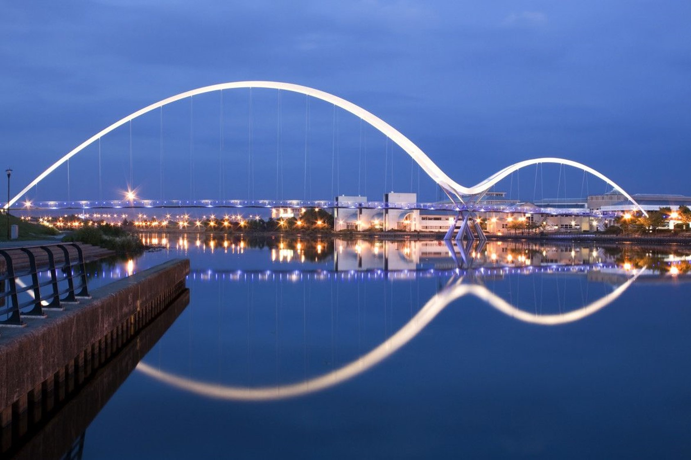
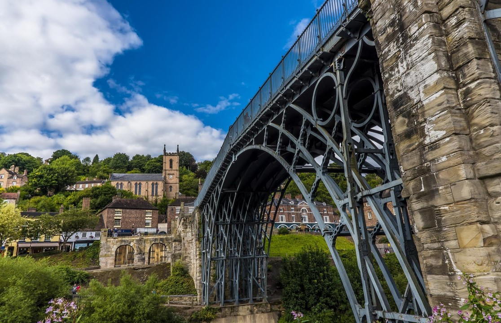
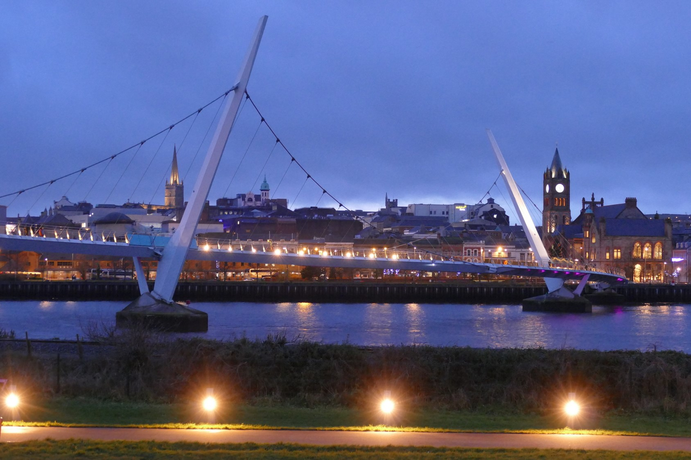
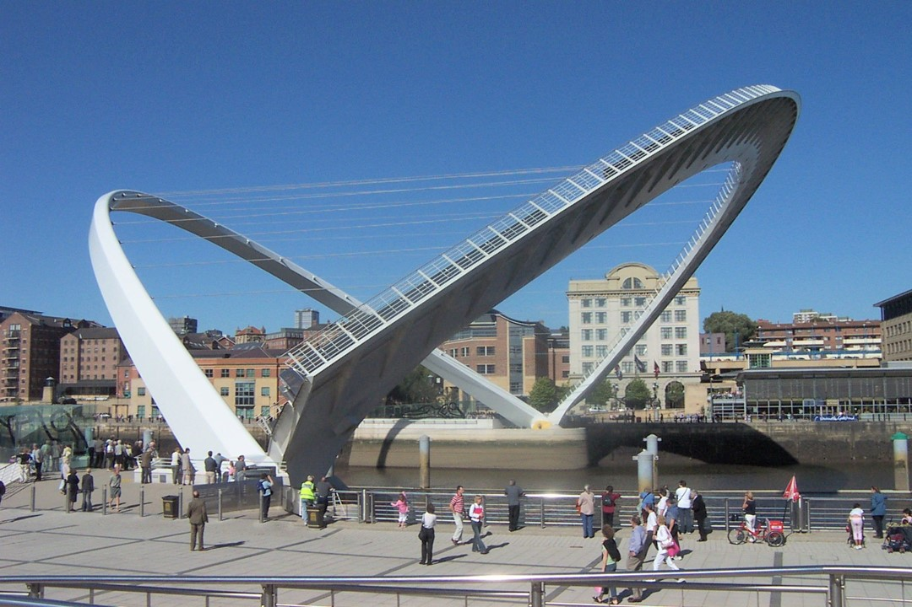

# The Davidsons' Quiz

|<!---->|<!---->|
|----|-------------|
|1|[The Simpsons](#/Simpsons)
|2|[Eurovision](#/Eurovision)
|3|[British Bridges](#/BritishBridges)
|4|[Fright Night](#/FrightNight)
|5|[1980's Music Emoji](#/MusicEmoji)
|6|[Whose baby is that?](#/Baby)
||
<!-- .element: class="fragment fade-up"-->

---
<!-- .slide: id="Simpsons" -->

## Round 1
# The Simpsons

---

## 1. What is the Simpsons' dog called?

---

## 2. What is the name of the cartoon show the Simpsons watch?

---

## 3. What is the name of the pub Homer drinks at?

---

## 4. What is the name of the Indian shop keeper?

---

## 5. What are Marge’s sisters called?

---

## 6. Who is Homer’s boss?

---

## 7. What is the name of Bart’s teacher?

---

## 8. What does Homer call the pig in The Simpsons Movie?

---

## 9. Which British Prime Minister has appeared in the Simpsons?

---

## 10. Which sport do Marge and Homer take home the gold medal for at the 2010 Winter Olympics?

---

## End of Round 1
# The Simpsons

# [↺](#/Simpsons)

---

## Round 1 - Answers

<h5>

|<!---->|<!---->|
|----|-------------|
|1|Santa's Little Helper
|2|The Itchy & Scratchy Show
|3|Moe's Tavern
|4|Apu Nahasapeemapetilon
|5|Patty & Selma
|6|Charles Montgomery Burns
|7|Edna Krabappel
|8|Spider Pig
|9|Tony Blair
|10|Mixed Curling
||
<!-- .element: class="fragment fade-up"-->
</h5>

---
<!-- .slide: id="Eurovision" -->

## Round 2
# Eurovision

---

## 1. What year was the first Eurovision?

---

## 2. How many countries were in the first Eurovision? 

---

## 3. Which country has won Eurovision the most times? 

---

## 4. The UK has won Eurovision 5 times. Name 2 of the winning performers.

---

## 5. Who will host the 2021 Eurovision Song Contest?

---

## 6. In what year did Graham Norton first become the UK presenter of Eurovision, taking over from Terry Wogan?

---

## 7. Name 2 countries that have competed in Eurovision that aren’t in Europe?

---

## 8. In 1968, Cliff Richards' song Congratulations was beaten by which country? 

---

## 9. Which country holds the record for the most number of total nil points? 

---

## 10. A Reading band entered *Song For Europe 2002* with a song called *Fancy My Chances*. What was the name of the drummer?

---

## End of Round 2
# Eurovision

# [↺](#/Eurovision)

---

## Round 2 - Answers

<h6>

|<!---->|<!---->|
|----|-------------|
|1|1956
|2|7 countries
|3|Ireland (7 times)
|4|Sandie Shaw, Lulu, Brotherhood of Man,  Bucks Fizz, Katrina and the Waves
|5|Netherlands
|6|2009 (16th May)
|7|Australia, Israel, Cyprus, Armenia, Morocco
|8|Spain (Massiel’s song La La La)
|9|Norway (4 times)
|10|Adam Davidson
<!-- .element: class="fragment fade-up"-->
</h6>

---
<!-- .slide: id="BritishBridges" -->

## Round 3
# British Bridges

---

①

---

② 

---

③

---

④

---

⑤

---

⑥

---

⑦

---

⑧ 

---

⑨ 

---

⑩ 

---

## End of Round 3
# British Bridges

# [↺](#/BritishBridges)

---

## Round 3 - Answers

<h5>

|<!---->|<!---->|
|----|-------------|
|1|Tower Bridge (London)
|2|Humber Bridge (Hull)
|3|Forth Bridge (Edinburgh)
|4|Tyne Bridge (Newcastle)
|5|Clifton Suspension Bridge (Bristol)
|6|Infinity Bridge (Stockton-on-Tees)
|7|The Iron Bridge (Telford)
|8|The Peace Bridge (Londonderry)
|9|Monnow Bridge (Monmouth)
|10|Gateshead Millennuim Bridge (Gateshead)
||
<!-- .element: class="fragment fade-up"-->
</h5>

---
<!-- .slide: id="FrightNight" -->

## Round 4
# Fright Night

---

## 1. How many instalments are there in the *Saw* series (2004-2017)? 

---

## 2. What was the name of Jodie Foster’s character in *The Silence of the Lambs* (1991)?  

---

## 3. What is the name of the prequel (2017) to *The Texas Chain Saw Massacre* (1974)? 

---

## 4. To stay alive in the film *The Ring* (2002), what should you avoid doing?  

---

## 5. In the movie *IT* (2017) what is written on two of the three doors?

---

## 6. What is the name of the motel in the Hitchcock classic *Psycho* (1960)? 

---

## 7. In the film *The Purge* (2013), how long does The Purge last? 

---

## 8. In *The Walking Dead* series (2010-2020), what dark secret does Terminus hold? 

---

## 9. What is the name of the human spaceship in *Alien* (1979)? 

---

## 10. In the movie *Final Destination* (2000) how were the main group supposed to die? 

---

## End of Round 4
# Fright Night

# [↺](#/FrightNight)

---

## Round 4 - Answers

<h5>

|<!---->|<!---->|
|----|-------------|
|1|8 (Saw 1-7, Jigsaw)
|2|Leatherface
|3|Clarice (Starling)
|4|Watching the Video Tape
|5|Not Scary at all, Scary, Very Scary
|6|Bates Motel
|7|12 hours
|8|They're Cannibals
|9|Nostromo
|10|Aeroplane Explosion
||
<!-- .element: class="fragment fade-up"-->
</h5>

---
<!-- .slide: id="MusicEmoji" -->

## Round 5
# 1980's Music Emoji

---

## 1. 🔫🔫🌹🌹

---

## 2. 🍌🍜

---

## 3. 🐝🐝☕👦👦

---

## 4. 🐐1️⃣1️⃣

---

## 5. 😂➗

---

## 6. 💧🏃💧🏃

---

## 7. 🌙🚶

---

## 8. 🐕🛒👦👦

---

## 9. 🙉🐆

---

## 10. 💬🗿🗿

---

## End of Round 5
# 1980's Music Emoji

# [↺](#/MusicEmoji)

---

## Round 5 - Answers

<h5>

|<!---->|<!---->|<!---->|
|----|----|-------------|
|1| 🔫🔫🌹🌹     | Guns and Roses
|2| 🍌🍜        | Bananarama(n)
|3| 🐝🐝☕👦👦 | Beastie Boys
|4| 🐐1️⃣1️⃣ | Ramones
|5| 😂➗ | Joy Division
|6| 💧🏃💧🏃 | Duran Duran
|7| 🌙🚶 | Michael Jackson
|8| 🐕🛒👦👦 | Pet Shop Boys
|9| 🙉🐆 | Def Leppard
|10| 💬🗿🗿 | Talking Heads
||||
<!-- .element: class="fragment"-->
</h5>

---
<!-- .slide: id="Baby" -->

## Round 6
# Whose baby is that?

---

# 1. Buddy Bear
<h3>

|<!---->|<!---->|
|----|-------------|
| Ⓐ | Chris Evans  |
| Ⓑ | Jamie Oliver |
| Ⓒ | James Corden |
|||
<!-- .element: class="fragment"-->
</h3>

---

# 2. Kal-El
<h3>

|<!---->|<!---->|
|----|-------------|
| Ⓐ | Nicolas Cage      |
| Ⓑ | Christopher Reeve |
| Ⓒ | Ben Affleck       |
|||
<!-- .element: class="fragment"-->
</h3>

---

# 3. Moroccan
<h3>

|<!---->|<!---->|
|----|-------------|
| Ⓐ | Bear Grylls     |
| Ⓑ | Mariah Carey    |
| Ⓒ | Kirstie Allsopp |
|||
<!-- .element: class="fragment"-->
</h3>

---

# 4. Bear Blaze
<h3>

|<!---->|<!---->|
|----|-------------|
| Ⓐ | Ethan Hawke       |
| Ⓑ | Leonardo DiCaprio |
| Ⓒ | Kate Winslet      |
|||
<!-- .element: class="fragment"-->
</h3>

---

# 5. Blue Ivy
<h3>

|<!---->|<!---->|
|----|-------------|
| Ⓐ | Ben Stiller |
| Ⓑ | Pink        |
| Ⓒ | Beyoncé     |
|||
<!-- .element: class="fragment"-->
</h3>

---

# 6. Reign 
<h3>

|<!---->|<!---->|
|----|-------------|
| Ⓐ | Simon Le Bon        |
| Ⓑ | Kourtney Kardashian |
| Ⓒ | Angelina Jolie      |
|||
<!-- .element: class="fragment"-->
</h3>

---

# 7. Apple
<h3>

|<!---->|<!---->|
|----|-------------|
| Ⓐ | Gwyneth Paltrow |
| Ⓑ | Steve Jobs     |
| Ⓒ | Hilary Duff    |
|||
<!-- .element: class="fragment"-->
</h3>

---

# 8. Memphis Eve
<h3>

|<!---->|<!---->|
|----|-------------|
| Ⓐ | Bono        |
| Ⓑ | Cher        |
| Ⓒ | Elvis       |
|||
<!-- .element: class="fragment"-->
</h3>

---

# 9. Blanket
<h3>

|<!---->|<!---->|
|----|-------------|
| Ⓐ | Prince          |
| Ⓑ | Michael Jackson |
| Ⓒ | Sting           |
|||
<!-- .element: class="fragment"-->
</h3>

---

# 10. X Æ A-12
<h3>

|<!---->|<!---->|
|----|-------------|
| Ⓐ | Robert Downey Jr. |
| Ⓑ | Bill Gates        |
| Ⓒ | Elon Musk         |
|||
<!-- .element: class="fragment"-->
</h3>

---

## End of Round 6
# Whose baby is that?

# [↺](#/Baby)

---

## Round 6 - Answers

<h5>

|<!---->|<!---->|<!---->|<!---->|
|----|----|-------------|-------------|
|1|Ⓑ|Jamie Oliver|Buddy Bear
|2|Ⓐ|Nicolas Cage|Kal-El
|3|Ⓑ|Mariah Carey|Moroccan
|4|Ⓒ|Kate Winslet|Bear Blaze
|5|Ⓒ|Beyoncé|Blue Ivy
|6|Ⓑ|Kourtney Kardashian|Reign
|7|Ⓐ|Gwyneth Paltrow|Apple
|8|Ⓐ|Bono|Memphis Eve
|9|Ⓑ|Michael Jackson|Blanket
|10|Ⓒ|Elon Musk|X-Ash-A-Twelve
||||
<!-- .element: class="fragment"-->
</h5>

---

## Thanks for playing
# The Davidsons' Quiz
