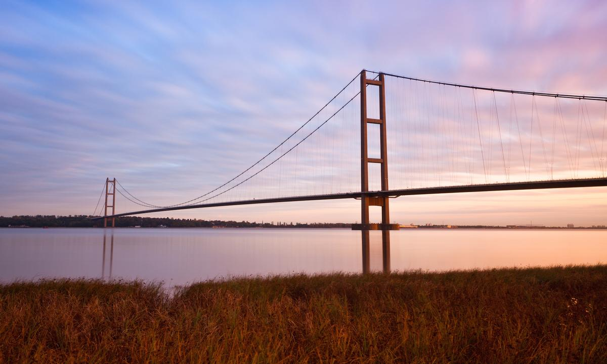

# The Davidson's Quiz

1. The Simpsons
2. Eurovision
3. British Bridges
4. Fright Night
5. 1980's Music Emoji
6. Who's baby is that?

---

## Round 1
# The Simpsons

---

## 1. What is the Simpson’s dog called?

---

## 2. What is the name of the cartoon show the Simpson's watch?

---

## 3. What is the name of the pub Homer drinks at?

---

## 4. What is the name of the Indian shop keeper? – Arpu

---

## 5. What are Marge’s sisters called? – Pattie & Selma

---

## 6. Who is Homer’s boss? – Charles Montgomery Burns

---

## 7. What is the name of Bart’s teacher? – Edna Krabappel

---

## 8. What does Homer call the pig in Simpsons the Movie?

---

## 9. Which British Prime Minister has appeared in the Simpsons?

---

## 10. Which sport do Marge and Homer take home the gold medal for at the 2010 Winter Olympics?

---

## End of Round 1
# The Simpsons

---

## Round 1 - Answers

1. Santa's Little Helper
2. The Itchy & Scratchy Show
3. Moe's Tavern
4. Apu Nahasapeemapetilon
5. Pattie & Selma
6. Charles Montgomery Burns
7. Edna Krabappel
8. Spider Pig
9. Tony Blair
10. Mixed Curling

---

## Round 2
# Eurovision

---

## 1. What year was the first Eurovision?

---

## 2. How many countries were in the first Eurovision? 

---

## 3. Which country has won Eurovision the most times? 

---

## 4. The UK has won Eurovision 5 times. Name 2 of the winning performers.

---

## 5. Who will host the 2021 Eurovision Song Contest?

---

## 6. In what year did Graham Norton first become the UK presenter of Eurovision, taking over from Terry Wogan?

---

## 7. Name 2 countries that have competed in Eurovision that aren’t in Europe?

---

## 8. In 1968, Cliff Richard’s song Congratulations was beaten by which country? 

---

## 9. Which country holds the record for the most number of nil points? 

---

## 10. In 2002 a Reading band entered A Song For Europe with a song called Fancy My Changes. What was the name of the drummer?

---

## End of Round 2
# Eurovision

---

## Round 2 - Answers

1.  1956
2.  7 countries
3.  Ireland (7 times)
4.  Sandie Shaw, Lulu, Brotherhood of Man, Bucks Fizz, Katrina and the Waves
5. Netherlands
6. 2009 (16th May)
7. Australia, Israel, Cyprus, Armenia, Morocco
8. Spain (Massiel’s song La La La)
9. Norway (4 times)
10. Adam Davidson

---

## Round 3
# British Bridges

---

---

---

---

---

---

---

---

---

---

---

## End of Round 3
# British Bridges

---

## Round 3 - Answers

1. Tower Bridge
2. Humber Bridge 
3. Forth Bridge
4. Tyne Bridge
5. Clifton Suspension Bridge
6. Infinity Bridge
7. The Iron Bridge
8. The Peace Bridge
9. The High Bridge
10. Gateshead Millenuim Bridge

---

## Round 4
# Fright Night

---

## 1. How many instalments are there in the Saw series? 

---

## 2. What was the name of Jodie Foster’s character in Silence of Lambs?  

---

## 3. What is the name of the prequel to Texas Chainsaw Massacre? 

---

## 4. To stay alive in the film The Ring, what should you avoid doing?  

---

## 5. In the movie IT (2017) what is written on the three doors?

---

## 6. What is the name of the motel in the Hitchcock class Psycho (1960)? 

---

## 7. In the film The Purge (2013), how long does the Purge last? 

---

## 8. In the Walking Dead Series, what dark secret does Terminus hold? 

---

## 9. What is the name of the (human) spaceship in Alien? 

---

## 10. In the movie Final Destination how were the main group supposed to die? 

---

## End of Round 4
# Fight Night

---

## Round 4 - Answers

1. 8 (Saw 1-7, Jigsaw)
2. Leatherface
3. Clarice (Starling)
4. Watching the Video Tape
5. Not Scary at all, Scary, Very Scary
6. Bates Motel
7. 12 hours
8. They're Cannibals
9. Nostromo
10. Airplane Explosion

---

## Round 5
# 1980's Music Emoji

---

## 1. 🔫🔫🌹🌹

---

## 2. 🍌🍜

---

## 3. 🐝🐝☕👦👦

---

## 4. 🐐1️⃣1️⃣

---

## 5. 😂➗

---

## 6. 💧🏃💧🏃

---

## 7. 🌙🚶

---

## 8. 🐕🛒👦👦

---

## 9. 🙉🐆

---

## 10. 💬🗿🗿

---

## End of Round 5
# 1980's Music Emoji

---

## Round 5 - Answers

1. Guns and Roses
2. Bananarama(n)
3. Beastie Boys
4. Ramones
5. Joy Division
6. Duran Duran
7. Michael Jackson
8. Pet Shop Boys
9. Def Leppard
10. Talking Heads

---

## Round 6
# Who's baby is that?

---

## 1.  

